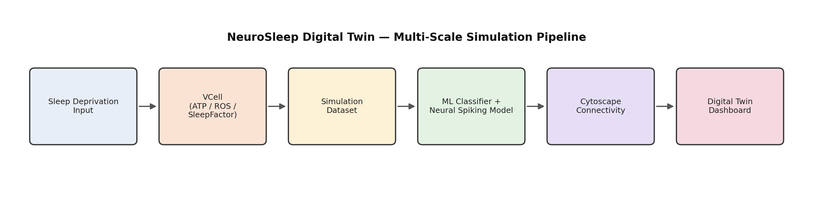
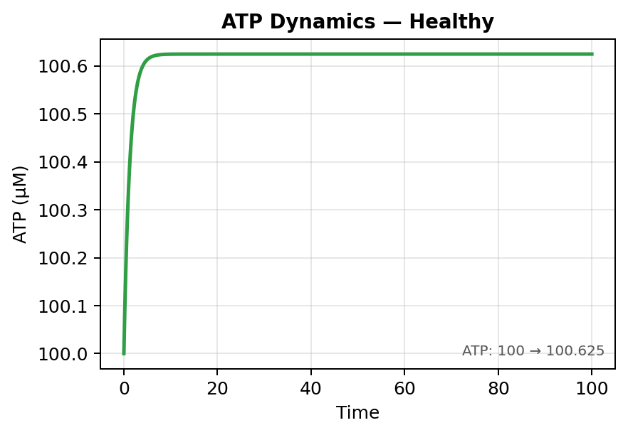
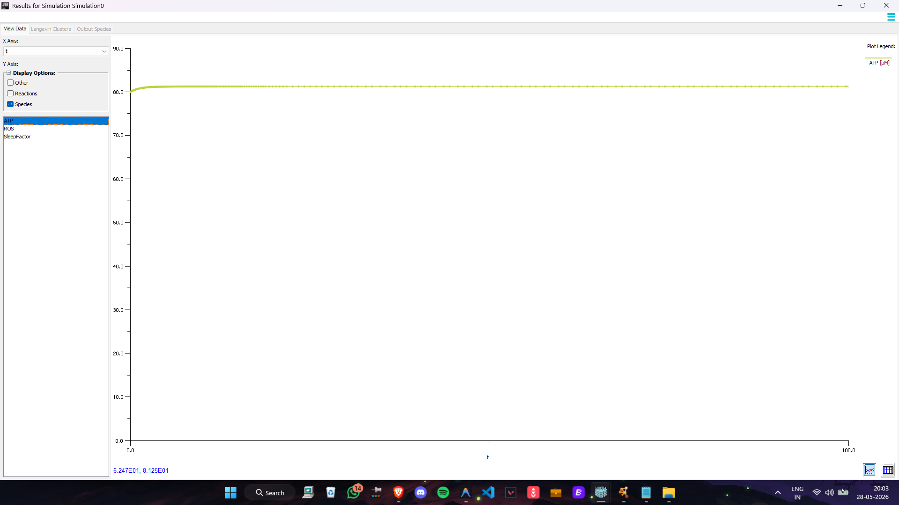
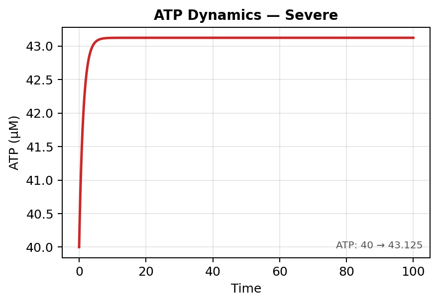
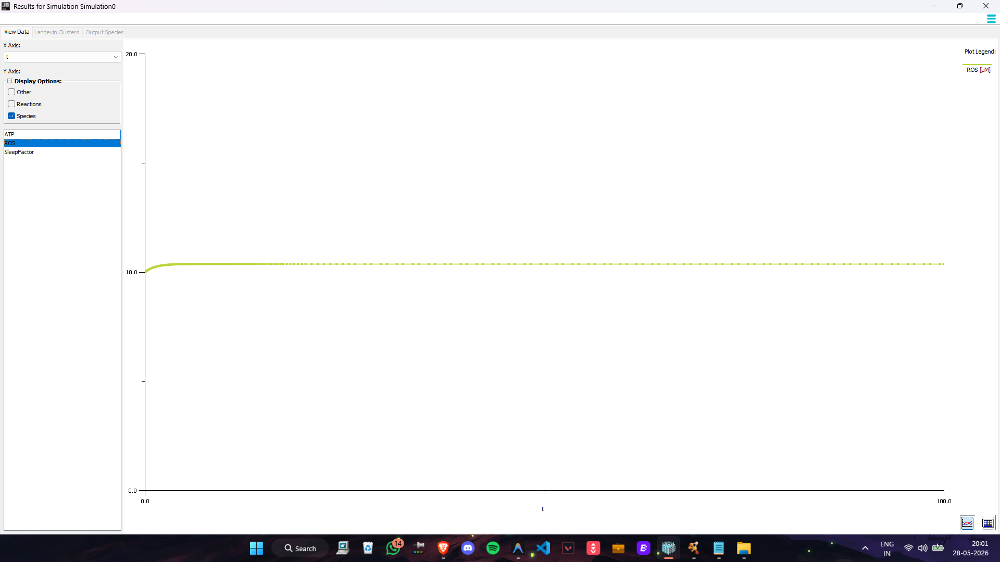
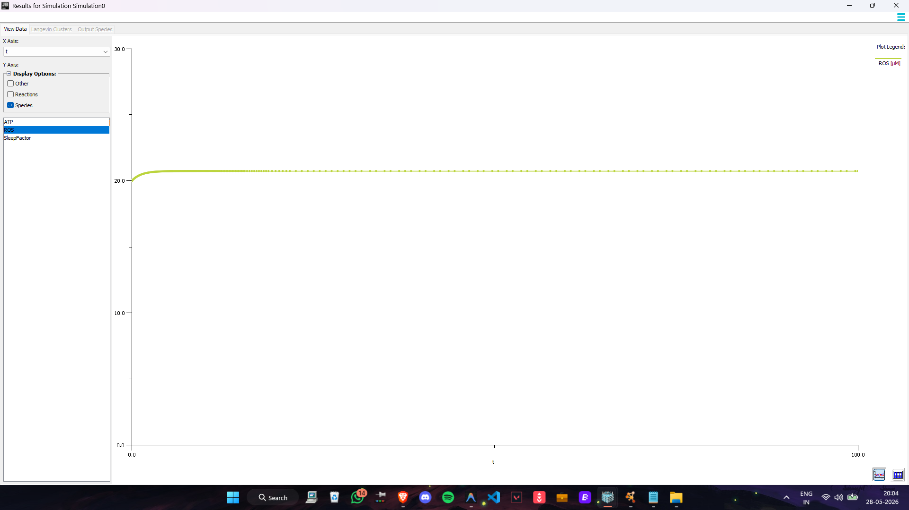
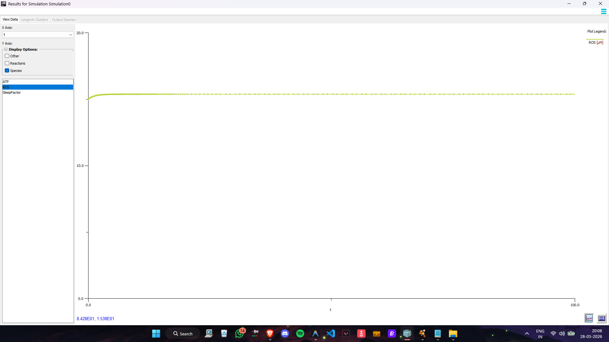
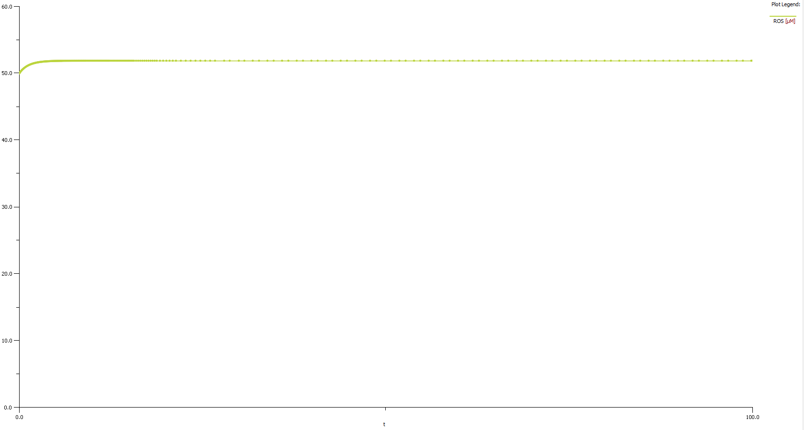
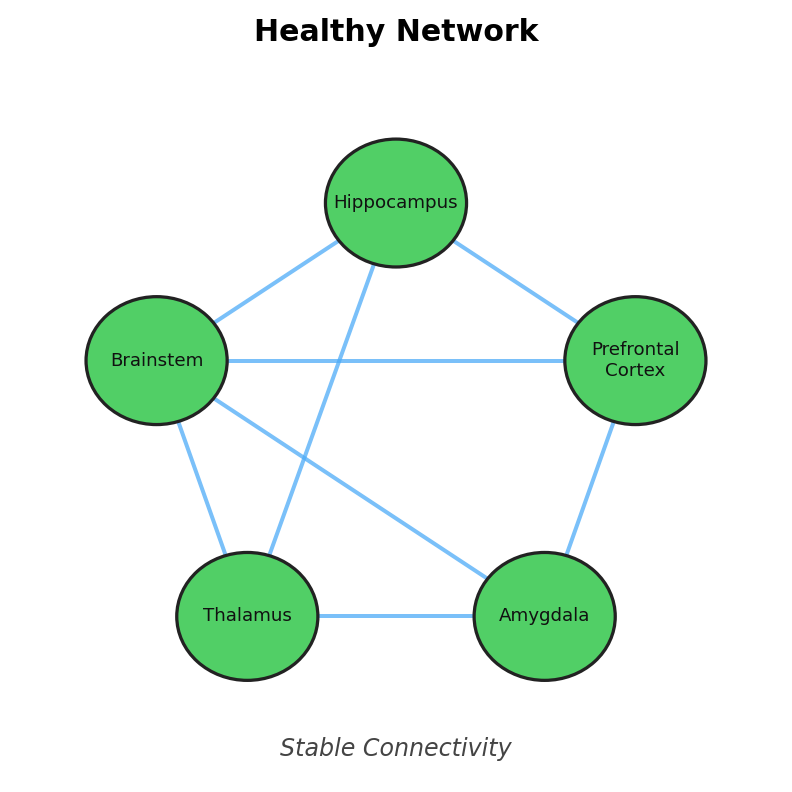
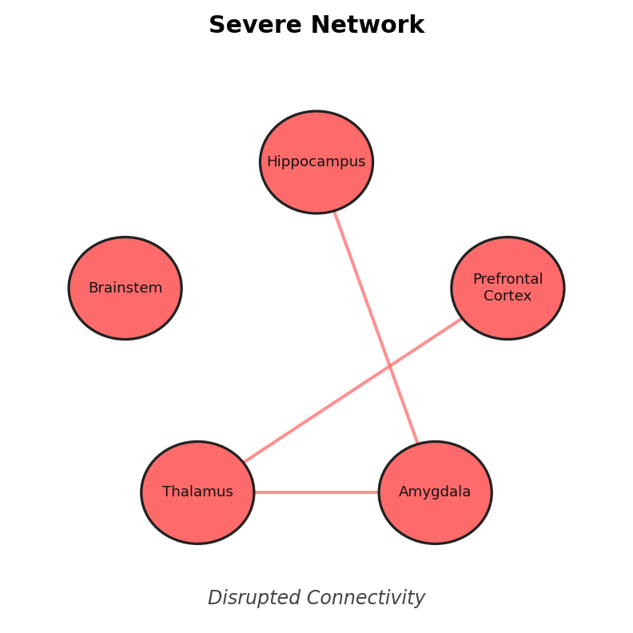

# 🧠 NeuroSleep Digital Twin Platform

A multi-scale computational framework that links cellular metabolic simulation, neuronal electrical activity, brain connectivity, and ML-based brain-state classification into one interactive Digital Twin dashboard for studying simulated sleep deprivation effects.


---

## 📌 Overview

Sleep deprivation affects cellular energy metabolism, oxidative stress, neuronal electrical activity, and communication between brain regions — but studying these effects experimentally across scales is complex and resource-intensive. NeuroSleep is a computational Digital Twin that models this chain instead: **VCell** simulates cellular metabolic stress (ATP, ROS, SleepFactor), a **Hodgkin-Huxley/FitzHugh-Nagumo-inspired model** represents neuronal electrical instability, **Cytoscape** maps the resulting brain connectivity, and **five ML classifiers** predict overall brain state. Everything is unified in an interactive dashboard that visualizes the full progression from healthy to severely deprived to recovery.

<p align="center">
  
</p>

## 📈 Simulation results

ATP and ROS dynamics per condition, exported directly from VCell (`Sleep_Deprivation_Model`, CVODE/IDA solver, t = 0–100).

<p align="center">
  
</p>
<p align="center">
  
</p>

## 🕸️ Connectivity progression

Illustrative reconstruction of the Cytoscape connectome across the four states — network density visibly drops from Healthy through Severe, consistent with the saved Cytoscape session's progression.

<p align="center">
  
</p>

## 🧬 How it works

1. **Cellular layer (VCell)** — a reaction-based model of ATP, ROS, and SleepFactor across four conditions (Healthy, Mild, Recovery, Severe), solved as a time-dependent stiff system (CVODE/IDA).
2. **Neuronal layer** — a simplified Hodgkin-Huxley/FitzHugh-Nagumo-inspired spiking model shows how metabolic stress destabilizes membrane potential and ionic conductances as severity increases.
3. **Network layer (Cytoscape)** — five key brain regions (Hippocampus, Prefrontal Cortex, Amygdala, Thalamus, Brainstem) are modeled as a connectivity graph that visibly weakens under increasing deprivation.
4. **AI layer** — Logistic Regression, Decision Tree, Random Forest, SVM, and KNN classify brain state (Healthy / Mild / Recovery / Severe) from ATP, ROS, SleepFactor, and a derived SeverityScore.
5. **Dashboard** — a React + Tailwind + Cytoscape.js interface integrates all layers into one Digital Twin view, with a scripted presentation mode (Healthy → 24h → 48h → 72h → Recovery) for demos.

## 📊 Results

All five classifiers reached 100% accuracy, precision, recall, and F1-score on the held-out test split of the simulation-derived dataset (1,189 samples, 4 balanced classes).

| Model | Accuracy |
|---|:---:|
| Logistic Regression | 1.00 |
| Decision Tree | 1.00 |
| Random Forest | 1.00 |
| SVM | 1.00 |
| KNN | 1.00 |

This isn't read as clinical accuracy — it reflects that the dataset is simulation-derived rather than clinical, and that `SeverityScore` is mathematically computed from the same variables the model is classifying against, making the classes highly separable. Real clinical data would need substantially more rigorous validation.

## ⚠️ Honest scope

Worth stating plainly, since parts of the pipeline are easy to overstate:

- **No real NEURON simulation.** The neuronal spiking model is a JavaScript implementation inspired by Hodgkin-Huxley/FitzHugh-Nagumo dynamics, not output from the NEURON software package.
- **Simulated EEG, not acquired EEG.** The dashboard's Beta/Alpha/Theta/Delta visualization is procedurally generated, not recorded from a real subject.
- **Not clinically validated.** This is an academic modeling and visualization prototype, not a diagnostic or clinical decision tool.
- **Two connectome models coexist.** The saved Cytoscape session uses a simplified 5-region network; the live dashboard uses a separate, more detailed 13-region procedural model.

## 🎯 Applications

- Sleep-deprivation and computational neuroscience research prototyping
- Multi-scale biological simulation and Digital Twin methodology demonstration
- Interactive visualization for academic teaching and viva/demo presentation

## 🛠️ Tech stack

`VCell` · `Cytoscape` · `Python` · `scikit-learn` · `React 18` · `Tailwind CSS` · `Cytoscape.js` · `Three.js` · `Web Audio API`

## 📁 Repo structure

```
├── vcell/
│   └── Sleep_Deprivation_Model.vcml       # ATP / ROS / SleepFactor reaction model
├── cytoscape/
│   └── Sleep_Deprivation_Brain_Network.cys
├── ml/
│   ├── acm.csv                            # simulation-derived dataset
│   └── acm_ml.ipynb                       # classifier training + prediction
├── dashboard/
│   ├── index.html
│   ├── simulation.js                      # cellular + neural simulation engine
│   ├── network.js                         # 13-node connectome engine
│   ├── sound.js
│   └── dashboard.js
├── assets/
│   ├── pipeline_diagram.png
│   ├── ATP_Healthy.png / ATP_Mild.png / ATP_Recovery.png / ATP_Severe.png
│   ├── ROS_Healthy.png / ROS_Mild.png / ROS_Recovery.png / ROS_Severe.png
│   └── Healthy_Network.png / Mild_Network.png / Recovery_Network.png / Severe_Network.png
└── README.md
```

## 👤 Author

**Aniket Patil**
CS (AI) undergraduate, KLE Technological University
